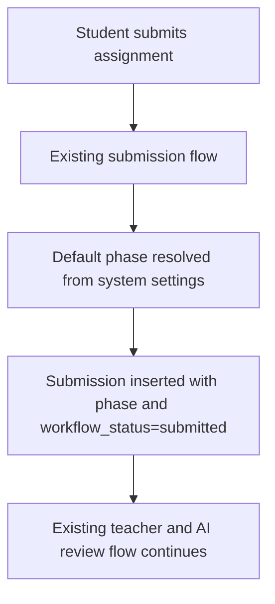
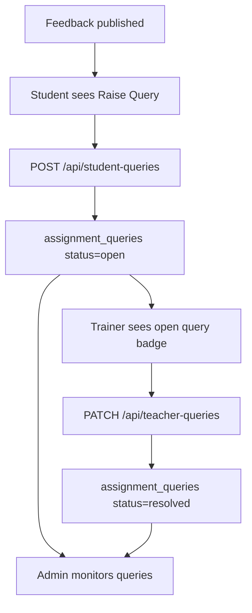

# Assignment Workflow

## Current Behavior

Student submission, trainer review, AI feedback, and publishing flows continue to operate through the existing fields and APIs.

## Workflow Status Foundation

The `workflow_status` column has been added to `submissions` with default `submitted`.

Valid statuses are defined in `lib/assignment-workflow.js`:

- `submitted`
- `processing`
- `ai_generated`
- `waiting_auto_approval`
- `trainer_editing`
- `published`
- `failed`

There is no database check constraint for these values. Validation is intended to happen at the application layer.

## Phase 1 Lifecycle

## Future Lifecycle Direction

Future phases can use `workflow_status` to coordinate auto approval, student queries, notifications, analytics, and timeline-style history.

Phase 1 does not activate those behaviors.

## Phase 2 Auto Approval

Auto approval is controlled by `system_settings`:

- `AUTO_APPROVAL_ENABLED`
- `AUTO_APPROVAL_DELAY`

The delay is stored as minutes. The application validates a minimum of 5 minutes and a maximum of 10080 minutes.

When AI feedback becomes ready and auto approval is enabled, the system sets `submissions.auto_approval_due_at`.

Vercel Cron calls `/api/cron/auto-approval` every 5 minutes. The endpoint acquires a Postgres advisory lock before processing so overlapping cron runs exit safely.

The cron publishes only due submissions where:

- `ai_status = ready`
- `ai_feedback` is present
- `feedback` is empty
- `auto_approval_due_at <= now()`

## Publishing Contract

All final feedback publishing uses `publishSubmissionFeedback()`.

The helper is the only application path that writes:

- `feedback`
- `feedback_by`
- `feedback_at`
- `approval_method`
- `approval_at`

Manual publish, trainer bulk approve, admin bulk approve, and auto approval all call this helper.

## Phase 3 Student Queries

Student queries are controlled by `system_settings.STUDENT_QUERY_ENABLED`.

When disabled:

- Student query UI is hidden.
- Trainer query UI is hidden.
- Admin query monitoring reports the disabled state.
- Query APIs return disabled responses instead of accepting writes.

When enabled, students can raise queries only after feedback has been published. Trainers can view and resolve queries only for submissions inside their existing batch scope. Admins can monitor query status through a read-only operational view with filters, detail drawer, timeline, overdue age badges, and CSV export.

## Phase 3.1 Notification Center

Notifications are stored in `notifications` and loaded through `/api/notifications`.

Notification bells are available in the student, trainer, and admin dashboards. Users can list recent notifications, see unread counts, open a notification to mark it read, or mark all notifications as read.

Notifications are created when:

- Feedback is published.
- A student raises a query.
- A trainer resolves a query.

Notifications support rich display metadata:

- icon
- severity
- action label
- action URL

Users can control notification preferences for feedback, student queries, query resolution, and admin alerts. Preferences are stored in `system_settings.NOTIFICATION_PREFERENCES`.

The notification bell subscribes to Supabase Realtime as a refresh signal where available and falls back to adaptive polling if realtime is unavailable. Notification rows remain protected by RLS, and all reads and writes continue through `/api/notifications`.

Expired notifications are pruned by the server helper using `system_settings.NOTIFICATION_RETENTION_DAYS`. Important pinned notifications are kept until read.

Admin notification panels also include lightweight analytics for total notifications, unread notifications, notification type counts, and average delivery time.

Operational overdue notifications are generated from existing open query timestamps when trainer/admin notification lists are loaded. This does not change the Student -> AI -> Trainer -> Admin workflow.

## Default Phase Assignment

Students do not select a phase. The server resolves the configured default phase using `system_settings.DEFAULT_PHASE` and the active `assignment_phases` catalog.

The existing `submissions.phase` field remains the compatibility field used by current screens.
